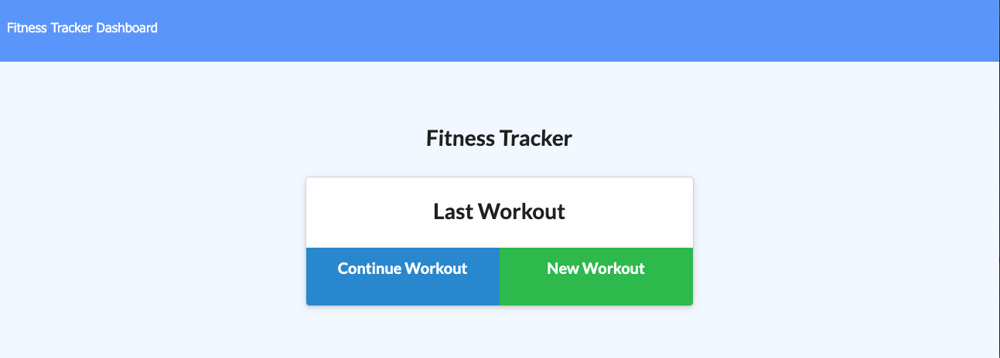
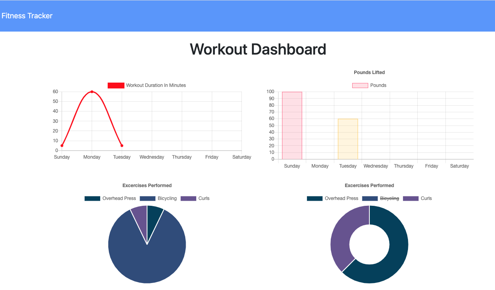

<h1>Workout Tracker</h1>
<h2>John Manouse</h2>

I created an application that will allow a user to view, create, & track their daily workouts. The user can continue an existing workout, create a new workout, designate the exercise type, and add new exercises. The user will also be able to view their "stats" from previous workouts. The Mongoose database will store the dates, and exercise properties, via the Mongoose Schema, using Express to handle the routes.

 
<h2>Workout Tracker Summary</h2>
<ul>
    <li>HTML code</li>
    <li>CSS</li>
    <li>Javascript</li>
    <li>node.js</li>
    <li>Express</li>
    <li>Mongoose</li>
</ul>

<h2>Pull Requests welcome for contribution</h2>

John Manouse

Live Link: <a href="https://mirageg4.github.io/Workout-Tracker/"
>Workout-Tracker Live Link</a>

Github: <a href="https://github.com/Mirageg4/Workout-Tracker">Workout-Tracker Repo</a>

 

             

License: Project is licensed under the MIT License. 
See <a href ="LICENSE.md">LICENSE</a> file for details.